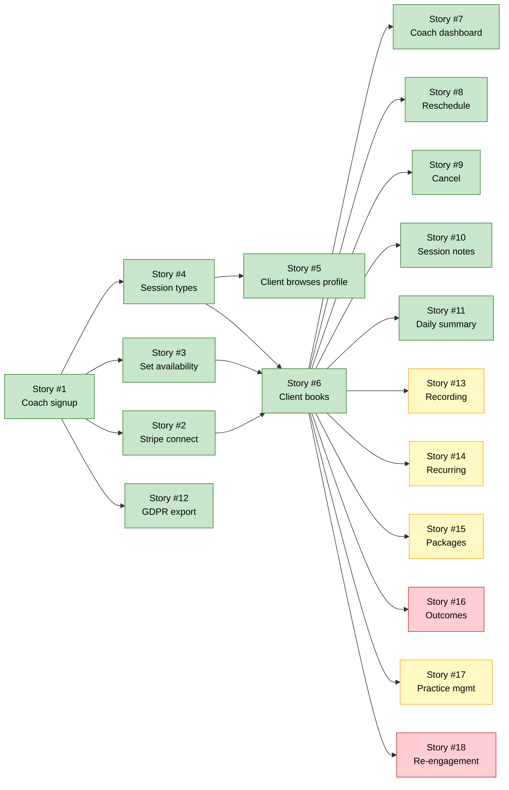

# Phasing Plan: Acme Coaching

**Project:** Acme Coaching
**Last updated:** 2026-09-02
**Owner:** BA Agent
**Reviewer:** Requirements Reviewer

> Detailed release phasing with dependency graph and parallelisable-work
> markers. PRD §8a is the executive table; this file is the deep plan
> the Orchestrator uses to schedule Code Agents, and the QA Agent uses
> to scope test cycles per phase.

---

## Phase definitions

| Phase | Goal | Definition of done | Target window |
|-------|------|--------------------|----------------|
| **MVP** | Coach onboarding → client booking → session → notes | All user stories #1–#12 implemented, tested, deployed to production, and meeting §6a KPI baselines | 2026-09-08 → 2026-12-15 |
| **Phase 2** | Recording, recurring bookings, packages, practice mgmt | All Phase 2 stories implemented; KPI uplift measured | 2027-01-15 → 2027-03-15 |
| **Phase 3** | Outcomes tracking, re-engagement | All Phase 3 stories implemented; sustained KPI improvement | 2027-05-15 → 2027-08-15 |
| **Backlog** | Captured but unscheduled | N/A | TBD |

---

## User stories by phase (mirror of PRD §8)

### MVP (must ship)

| Story # | Summary | Story points | Dependencies on other stories | Can be built in parallel? |
|---------|---------|--------------|-------------------------------|----------------------------|
| #1 | Coach signs up with email | S | None | Yes (with #2, #3, #4, #5) |
| #2 | Coach connects Stripe | S | #1 (auth) | Yes (with #3, #4, #5) |
| #3 | Coach sets weekly availability | M | #1 | Yes (with #4) |
| #4 | Coach defines session type | S | #1 | Yes (with #3) |
| #5 | Client browses coach's profile | M | #4 (needs session types to display) | No (after #4) |
| #6 | Client books a session | L | #2 (Stripe), #3 (availability), #4 (session types) | No (depends on #2, #3, #4) |
| #7 | Coach sees upcoming sessions | S | #6 (needs bookings) | No (after #6) |
| #8 | Client reschedules booking | M | #6 | No (after #6) |
| #9 | Client cancels booking | M | #6 | No (after #6) |
| #10 | Coach writes session notes | S | #6 (needs completed bookings) | No (after #6) |
| #11 | Coach daily summary email | S | #6 | No (after #6) |
| #12 | Coach exports data (GDPR) | M | #1 | Yes (with #7–#11) |

**Total MVP story points:** ~3S + 6M + 1L + 2XL = est. 12–15 weeks of solo-engineer time.

### Phase 2

| Story # | Summary | Story points | Dependencies | Notes |
|---------|---------|--------------|--------------|-------|
| #13 | Record video session | XL | MVP | Deferred from MVP — consent UX needs design |
| #14 | Recurring weekly booking | L | #6 | Deferred from MVP — UX needs research |
| #15 | Define package (6 for price of 5) | L | #6 | Deferred from MVP — payment complexity |
| #17 | Practice manager multi-coach view | XL | MVP | Priya persona is Phase 2 |

### Phase 3

| Story # | Summary | Story points | Dependencies | Notes |
|---------|---------|--------------|--------------|-------|
| #16 | Track client outcomes | XL | MVP + #15 (packages often have outcome goals) | Deferred — needs metrics research |
| #18 | Re-engagement nudge | M | MVP | Deferred — needs user base |

### Backlog (captured, unscheduled)

| Story # | Summary | Notes |
|---------|---------|-------|
| (none yet) | | |

---

## Dependency graph



**Plain-text fallback:**

```
S1 ──► S2 ──┐
S1 ──► S3 ──┤
S1 ──► S4 ──┼──► S6 ──► S7
            │       ├─► S8 ──► (end)
            │       ├─► S9 ──► (end)
            │       ├─► S10 ──► (end)
            │       ├─► S11 ──► (end)
            │       ├─► S13 (Phase 2) ──► (end)
            │       ├─► S14 (Phase 2) ──► (end)
            │       ├─► S15 (Phase 2) ──► S16 (Phase 3)
            │       ├─► S17 (Phase 2) ──► (end)
            │       └─► S18 (Phase 3) ──► (end)
S4 ──► S5 ──► (end)
S1 ──► S12 (parallel) ──► (end)
```

**Legend:**
- Green = MVP, Yellow = Phase 2, Red = Phase 3
- `S1 → S2` means "S1 must be done before S2 can start"

---

## Parallelisation rules

1. **A story can be built in parallel with another story** if neither has a dependency on the other.
2. **A Code Agent's branch is per-story**, not per-phase. Branch name: `feature/<story-number>-<short-name>`.
3. **Cross-story refactors** (e.g., introducing a shared "scheduling" component) must be done in the earliest story that needs them.
4. **Phase boundaries are review boundaries.** A phase is not "done" until every story in it has passed QA and the cumulative KPIs from §6a have been measured.

**Concrete parallel-work plan for MVP sprint 1 (week 1–2):**
- Code Agent A: Story #1 (auth scaffold) + Story #12 (GDPR export) — both depend only on auth being scaffolded
- Code Agent B: Story #3 (availability) once auth is in
- Code Agent C: Story #4 (session types) once auth is in

After sprint 1, Story #6 (the critical-path booking flow) becomes the focus of all 3 Code Agents until it ships.

---

## Phase exit criteria

### MVP exit

- [ ] All MVP stories (#1–#12) implemented and merged
- [ ] All MVP stories have passing Playwright tests traced to their story ID
- [ ] NFR catalog: all P0 NFRs (SEC-001..010, A-001, B-001..006, DR-001, P-001..005) passing in production
- [ ] Pen test completed with no high/critical findings
- [ ] DPIA (Data Protection Impact Assessment) signed off by Lee
- [ ] Production deploy successful
- [ ] Monitoring + alerting live
- [ ] Runbook + on-call rotation established
- [ ] §6a KPIs baselined (post-launch, 7 days)

### Phase 2 exit

- [ ] All Phase 2 stories (#13–#15, #17) implemented and merged
- [ ] KPI uplift measured against baseline (target: no-show rate <6%, activation rate coach ≥70%)
- [ ] All P1 NFRs from catalog passing

### Phase 3 exit

- [ ] All Phase 3 stories (#16, #18) implemented and merged
- [ ] All P2 NFRs from catalog passing
- [ ] Architecture review for any Phase 4 (if planned)

---

## Risks to the phasing plan

| Risk | Affected phase | Mitigation |
|------|----------------|------------|
| Story #6 (booking) takes longer than estimated because of Stripe + Daily.co integration complexity | MVP | Solved 3 weeks before exit; cut #14 (recurring) to Phase 2 if needed |
| Daily.co EU data residency can't be confirmed (OQ-008) | MVP | Use Zoom as fallback (already vetted, has EU region) |
| EU-only constraint raises infra cost beyond €400/mo (R-006) | MVP | Negotiate with Carmen; consider multi-region in Phase 2 if needed |

---

*When a story moves between phases, update this file AND the §8 / §8a tables in `prd.md` AND the dependency graph. The three must stay in sync.*
