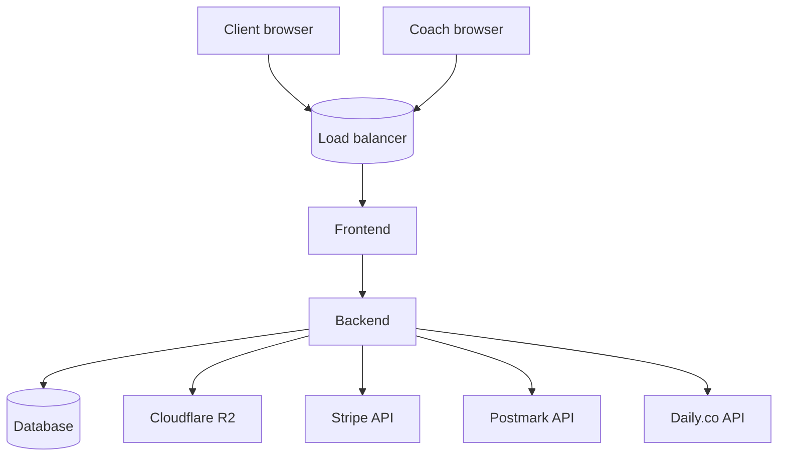

# Tech Decision Brief: Acme Coaching

**Project:** Acme Coaching
**Last updated:** 2026-09-02 (BA half complete) | SA half pending
**Part 1 owner:** BA Agent
**Part 2 owner:** Solution Architect (not yet assigned)
**Reviewer:** Requirements Reviewer (Part 1 only)

> This is the canonical BA→SA handoff contract. **Part 1** is filled
> by the BA from the PRD and its supporting artifacts. **Part 2** is
> filled by the Solution Architect after reviewing Part 1 and meeting
> with Sam (eng lead). The Orchestrator promotes the brief from
> "Pending" to "Signed" only when both halves are complete.

---

## Status legend

- **Part 1 fields:** ✅ filled | 🟡 partial (need SA discussion) | ⚪ blank (intentionally omitted by BA)
- **Part 2 fields:** 🟡 partial (SA work-in-progress) | ⬜ not started | ✅ complete

---

# Part 1 — BA inputs

> Part 1 captures everything the SA needs to choose the stack. Most fields
> are filled from the PRD and the `supporting/` artifacts. Where the SA
> needs more information than the BA can provide, the BA marks the field
> 🟡 and adds a note for SA discussion.

## 1.1 Project summary

**What are we building?** An online booking + session-management platform for independent coaches. Replaces the Calendly + Stripe + WhatsApp + Drive stack Carmen Diaz (primary user) and her pilot coaches are patching together. Must support coach onboarding (signup → Stripe Connect → availability → session types) and client booking (browse → book → pay → reschedule/cancel → join video → receive notes).

**Who is it for?** Primary: Coach Carmen (independent life coach with 30+ clients). Secondary: Client Carla (her typical client, who books via phone). Future Phase 2: Practice Manager Priya (small coaching practices with 3–5 coaches).

**Why now?** Carmen has 3 pilot coaches ready to onboard within 30 days of MVP launch. Pilot coaches are willing to pay €30/month from day 1 (Verifiable: yes, see Carmen's market research 2026-07).

**MVP target:** 2026-12-15. (Hard date — Carmen has a coaching summit in January 2027 where she'll demo the product live.)

---

## 1.2 Hard tech constraints

> "Hard" = non-negotiable. Any deviation requires Carmen + Steering
> Committee approval (decision rights in `stakeholder-map.md`).

| Constraint | Source | Reason |
|------------|--------|--------|
| Must use **Stripe** for payments (incl. Stripe Connect for coach onboarding) | PRD §3b | Carmen + 3 pilot coaches already have Stripe; switching would cost 1 sprint of re-onboarding |
| Must use **Postmark** for transactional email | PRD §3b | Carmen's existing product uses it; team has operational expertise |
| Must use **Daily.co** for video (fallback: Zoom, both have EU region) | PRD §3b | 99.9% SLA, EU region available pending OQ-008, Carmen's existing product uses it |
| Must use **Cloudflare R2 (EU region)** for object storage | PRD §3b | EU-only data residency; S3-compatible API; R2 pricing is lower for our access pattern |
| **EU-only** data residency (DB, object storage, video infra) | PRD §3b + open question OQ-007 | GDPR — pending Carmen + Lee confirmation by 2026-09-10; default is yes |
| No **Firebase**, no AWS Lambda, no Firebase Auth | PRD §3b | Carmen's constraint — vendor lock-in + GDPR risk; team rationale in §3b notes |
| Browser support: last 2 versions of Chrome, Safari, Firefox, Edge + mobile Safari/Chrome | Assumption A-001 | 98%+ of comparable product users on evergreen browsers |
| Performance budget as in PRD §3a + `nfr-catalog.md` P-001..005 | PRD §3a | Aggressive but feasible per Sam (see reviewer 3a.1) |

> **🟡 Note for SA**: OQ-007 (EU-only confirmation) is the single biggest
> constraint risk. If Carmen decides NO, the architecture can shift
> significantly (US-east-1 becomes viable, more providers qualify).
> Track this against the SA's choices.

---

## 1.3 Stack-selection questionnaire

> These 5 questions mirror `code-builder/config-rules.md` §User
> Questions. They're filled by the BA from the PRD and stakeholder
> interviews so the SA does not have to re-ask the BA. The SA may
> still need follow-ups — those go in §2.7.

1. **Team familiarity with any framework?**
   - Frontend: React + TypeScript, 3 years (Sam + 2 future hires).
   - Backend: Node.js (Express, Fastify), 2 years.
   - No PHP, no Vue, no Svelte experience.
   - **Source:** Sam interview 2026-08-18

2. **Hosting preference or requirement?** Open. Team has deployed to
   AWS + Vercel in past projects. GDPR constraint rules out most US-East
   providers for DB tier. Lean toward Vercel for frontend (EU region
   available), AWS Frankfurt for backend (EU region).

3. **Relational vs document DB preference?** Open. Booking flow needs
   strong consistency (avoiding double-bookings is critical) — favors
   relational. SA's call.

4. **Monolith vs microservices?** Prefer monolith at MVP; cut to
   services only when actually needed. SA's call to confirm.

5. **Existing tech to integrate or avoid?**
   - Integrate: existing Carmen site (WordPress) for SEO + marketing
     pages. The booking flow lives in the new app; marketing pages stay
     on WordPress.
   - Avoid: Firebase (Carmen constraint), any vendor without EU region
     for DB tier.

---

## 1.4 Integrations

| Integration | Required by MVP? | Linked PRD section | Linked story |
|-------------|------------------|---------------------|---------------|
| **Stripe Connect** | Yes | §9b | #2, #6, #8, #9 |
| **Stripe webhooks** | Yes | §9b | #6, #8, #9 |
| **Postmark** (transactional email) | Yes | §9b | #6, #8, #9, #10, #11, #12 |
| **Daily.co** (video sessions) | Yes | §9b | #6 (room creation + token expiry) |
| **Google Calendar / ICS** (calendar invites) | Yes | §8 #6 AC-4 | #6 |
| **Cloudflare R2** (object storage) | Yes (coach photos, session files) | §3b, §9a Coach.photo_url | #1, #10 |
| **WordPress embed** (for marketing pages) | Nice-to-have | Non-functional wish | (none) |
| **SMS notifications** | No (deferred Phase 2) | §8a | (none at MVP) |
| **WhatsApp integration** | No (deferred Phase 2) | §8a | (none at MVP) |

> **🟡 Note for SA:** EU data residency applies to ALL integrations.
> Specifically: Stripe Connect account data must be EU-stored; Postmark
> EU transactional stream; Daily.co EU region (pending OQ-008). See
> `risks.md` R-010 for the Daily.co risk.

---

## 1.5 Data sensitivity

See `data-model.md` for the full breakdown. Summary:

| Data type | Source | Encryption | Retention |
|-----------|--------|-------------|-----------|
| Email (Coach, Client) | direct entry | column-level encryption | 30 days post-delete |
| Name (Coach, Client) | direct entry | column-level encryption | 30 days post-delete |
| Bio (Coach) | direct entry | column-level encryption | 30 days post-delete |
| Session note content | direct entry (Coach) | column-level encryption | 30 days post-delete |
| Booking, Payment (financial) | system-generated | DB-encrypted at rest | 7 years (tax requirement) |
| Photo URL | direct upload to R2 | N/A (URL only) | 30 days post-delete |
| Video session content | Daily.co | Daily.co's responsibility | Daily.co SLA (3 months) |
| Access logs of PII | server-generated | hashed user IDs | 1 year (security audit) |

**PII classifications:** Direct PII (email, name, bio, payment), Indirect PII (booking/note/PackagePurchase links to user).

**Right-to-erasure (GDPR Article 17):** mandatory end-to-end flow, 30-day grace period, audit-log tombstone. See `data-model.md` §Deletion & GDPR flows.

**Data portability (GDPR Article 20):** Coach + Client export via signed link, 24h expiry. See `data-model.md` §Deletion & GDPR flows.

---

## 1.6 Compliance & residency

| Requirement | Standard | Owner | Validation |
|-------------|----------|-------|------------|
| GDPR full compliance | GDPR + UK GDPR | Lee | DPIA + DPO sign-off pre-launch |
| WCAG 2.1 AA accessibility | WCAG 2.1 AA | Priya + Sam | Per-PR automated axe-core + quarterly manual screen reader test |
| PCI DSS (handled by Stripe) | SAQ-A | Sam | Stripe Connect handles card data; we never touch PAN |
| PII column-level encryption | Internal policy | Sam + Lee | Quarterly audit |
| Right-to-erasure flow | GDPR Article 17 | Lee + Sam | Manual test + DPO sign-off pre-launch |
| Data portability flow | GDPR Article 20 | Lee + Sam | Manual test pre-launch |
| Penetration test | Internal policy | Lee | External pen test pre-launch, no high/critical findings |

> **🟡 Note for SA:** Confirm that the chosen providers (Vercel, AWS
> Frankfurt, Cloudflare R2 EU) have the certifications required
> (ISO 27001, SOC 2) and that the EU region for each is the default
> region for our account.

---

## 1.7 NFR targets (from `nfr-catalog.md`)

The SA must architect to meet these. Each row links to the full
testable statement in the catalog.

| ID | One-line target | Source |
|----|-----------------|--------|
| P-001 | p95 page response time < 2.0s on 3G | nfr-catalog.md §Performance |
| P-002 | API p95 latency < 300ms | nfr-catalog.md §Performance |
| P-003 | FCP < 1.0s desktop cold | nfr-catalog.md §Performance |
| P-004 | TTI < 3.0s mobile mid-tier | nfr-catalog.md §Performance |
| P-005 | Booking creation p95 < 500ms | nfr-catalog.md §Performance |
| S-001 | 1k concurrent users at MVP launch | nfr-catalog.md §Scalability |
| AV-001 | Monthly uptime 99.5% | nfr-catalog.md §Availability |
| AV-002 | Degraded mode when Stripe/Daily/Postmark outage | nfr-catalog.md §Availability |
| OBS-001..006 | Structured logs + tracing + alerting + audit logging | nfr-catalog.md §Observability |
| SEC-001..010 | See catalog (auth, encryption, rate limit, CSRF, webhook sig, etc.) | nfr-catalog.md §Security & compliance |

---

## 1.8 Blocking open questions

These are blocking the SA's Part 2 work. Resolved before the brief can be signed.

| ID | Question | Owner | Expected resolution |
|----|----------|-------|----------------------|
| OQ-007 | Is EU-only data residency a hard requirement even if it raises costs? | Carmen + Lee | 2026-09-10 |
| OQ-008 | Can Daily.co confirm EU-only data handling? | Lee | 2026-09-10 |

**Downstream impact if OQ-007 becomes NO:**
- US-east-1 becomes viable for DB tier
- More providers qualify (e.g., Planetscale US)
- Architecture can drop the EU-only constraint throughout

**Downstream impact if OQ-008 becomes NO:**
- Switch video provider from Daily.co to Zoom (already vetted, has EU region)
- Story #6 AC-4 changes text from "Daily.co video link" to "video link"
- No material architecture impact beyond SDK choice

---

## 1.9 Phasing window

| Phase | User stories | Window |
|-------|--------------|--------|
| MVP | #1–#12 | 2026-09-08 → 2026-12-15 |
| Phase 2 | #13, #14, #15, #17 | 2027-01-15 → 2027-03-15 |
| Phase 3 | #16, #18 | 2027-05-15 → 2027-08-15 |

**Architecture considerations per phase:**
- MVP must be one cohesive system that delivers all 12 stories
- Phase 2 stories (#13 recording, #14 recurring, #15 packages, #17 practice mgr) should not require restructuring — only additions
- Phase 3 stories (#16 outcomes, #18 re-engagement) are analytics-y; SA should consider whether MVP's data shape supports them or a separate analytics pipeline is needed

---

## BA sign-off on Part 1

**Signed by:** BA Agent
**Date:** 2026-09-02
**Reviewer:** Requirements Reviewer (signed off 2026-09-02, see `reviewer-comments.md`)

> **Note for SA:** The BA has signed off Part 1. Part 2 below is
> blank. **Fill Part 2 and have Sam sign the SA block in §2.8** before
> the brief can be promoted to the design phase.

---

# Part 2 — SA outputs

> Part 2 is filled by the Solution Architect after Part 1 is signed.
> The SA reviews Part 1, meets with Sam, makes the architecture choices,
> and fills every section. The brief is "Signed" only when both Part 1
> BA and Part 2 SA have signed.

## 2.1 Chosen stack

*(SA: fill in)*

| Layer | Choice | Version | Reason |
|-------|--------|---------|--------|
| Frontend framework | (fill) | (fill) | (fill) |
| Frontend hosting | (fill) | (fill) | (fill) |
| Backend runtime | (fill) | (fill) | (fill) |
| Backend hosting | (fill) | (fill) | (fill) |
| Database (DBaaS or self-hosted) | (fill) | (fill) | (fill) |
| ORM / data access layer | (fill) | (fill) | (fill) |
| Email service | Postmark | (n/a) | Carried over from BA Part 1 §1.4 |
| Payments service | Stripe + Stripe Connect | (n/a) | Carried over from BA Part 1 §1.4 |
| Video service | Daily.co (or Zoom if OQ-008 unresolved) | (n/a) | Carried over from BA Part 1 §1.4 |
| Object storage | Cloudflare R2 EU | (n/a) | Carried over from BA Part 1 §1.4 |
| Background jobs / cron | (fill) | (fill) | (fill) |
| Search / full-text | (fill or "not needed at MVP") | (fill) | (fill) |
| Analytics / observability | (fill) | (fill) | (fill) |
| Auth | (fill) | (fill) | (fill) |
| CI/CD | (fill) | (fill) | (fill) |

## 2.2 Rationale per choice

*(SA: fill in — for each row in §2.1, add 1–3 paragraphs explaining why this choice fits the constraints in Part 1)*

## 2.3 Architecture diagram

*(SA: paste a Mermaid diagram showing the request flow + data flow + deployment topology)*

*(SA: flesh this out with request paths, error flows, deployment regions, EU-region markers)*

## 2.4 Data model proposal

*(SA: translate `data-model.md` into actual schema — table names, columns, types, indexes, FKs. If you deviate from `data-model.md`, flag the deviation back to the BA via §2.7)*

## 2.5 Integration plan

*(SA: for each integration in Part 1 §1.4, document the integration approach: SDK or HTTP, auth method, webhook signature verification, retry/timeout policy, region pinning)*

### Stripe
- (fill)

### Stripe Connect
- (fill)

### Postmark
- (fill)

### Daily.co
- (fill)

### Cloudflare R2
- (fill)

## 2.6 Risk additions

*(SA: add any new risks you uncovered while filling Part 2 to `risks.md`. For each, include ID, category, likelihood, impact, mitigation, trigger, owner.)*

Suggested template:
- **R-011 — [risk]:** [category]; [likelihood]; [impact]; [mitigation]. [trigger]. [owner].

## 2.7 Questions for BA

*(SA: list anything you needed that Part 1 didn't capture. The BA will respond in `open-questions.md` with `Resolved` entries.)*

Use the form: "Q-NNN: [question]. [Why needed]. [Suggested resolution approach]."

---

## 2.8 Sign-off block

### SA sign-off

**Signed by:** *(SA name)*
**Date:** *(fill)*
**Conflicts with Part 1?** *(none / list the fields you had to deviate from and why)*
**Open Part 2 questions for BA?** *(list — should be empty for full sign-off)*

### Engineering Lead sign-off

**Signed by:** Sam Wright
**Date:** *(fill)*
**Constraints validated?** *(cross-check against Part 1 §1.2 hard constraints)*

### Promoted to design phase?

- [ ] Yes — design agents can start
- [ ] No — see Part 2 §2.7 blocking questions

---

*When this brief is fully signed (BA Part 1 + SA Part 2 + Sam Part 2), it becomes the input to the Design Agents and the source of truth for "what stack are we building?". If a new constraint emerges during design, code, or QA review, add an addendum to Part 2 — do not silently revise the stack.*
