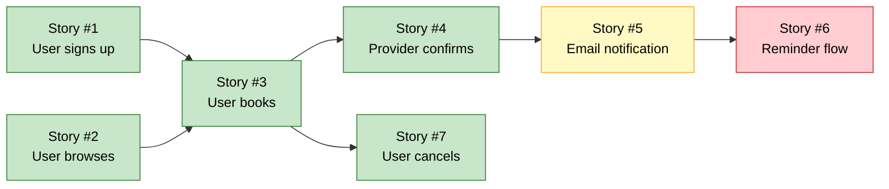

# Phasing Plan: <Project Name>

> Detailed release phasing with dependency graph and parallelisable-work
> markers. PRD §8a is the executive table; this file is the deep plan
> the Orchestrator uses to schedule Code Agents, and the QA Agent uses
> to scope test cycles per phase.

**Project:** <Project Name>
**Last updated:** <Date>
**Owner:** BA Agent
**Reviewer:** Requirements Reviewer

---

## Phase definitions

| Phase | Goal | Definition of done | Target window |
|-------|------|--------------------|----------------|
| **MVP** | First release; smallest thing that delivers user value | All user stories marked MVP in PRD §8 are implemented, tested, deployed to production, and meeting §6a KPI baselines | <date range> |
| **Phase 2** | High-value follow-ups after product-market fit signal | All Phase 2 stories implemented; KPI uplift measured | <date range> |
| **Phase 3** | Growth and scale features | All Phase 3 stories implemented; sustained KPI improvement | <date range> |
| **Backlog** | Captured but unscheduled | N/A | TBD |

---

## User stories by phase (mirror of PRD §8)

### MVP (must ship)

| Story # | Summary | Story points | Dependencies on other stories | Can be built in parallel? |
|---------|---------|--------------|-------------------------------|----------------------------|
| #1 | <text> | S | None | Yes (with #2, #3) |
| #2 | <text> | M | None | Yes (with #1, #3) |
| #3 | <text> | M | #1 (needs auth) | No (depends on #1) |
| ... | ... | ... | ... | ... |

**Total MVP story points:** <sum>

### Phase 2

| Story # | Summary | Story points | Dependencies | Notes |
|---------|---------|--------------|--------------|-------|
| #5 | <text> | L | MVP | <why deferred from MVP> |
| ... | ... | ... | ... | ... |

### Phase 3

| Story # | Summary | Story points | Dependencies | Notes |
|---------|---------|--------------|--------------|-------|
| #8 | <text> | XL | MVP + Phase 2 | <why Phase 3> |
| ... | ... | ... | ... | ... |

### Backlog (captured, unscheduled)

| Story # | Summary | Notes |
|---------|---------|-------|
| #10 | <text> | <what's needed to schedule — e.g., "validate with users first"> |
| ... | ... | ... |

---

## Dependency graph

> Use a Mermaid diagram (rendered natively in GitHub, GitLab, and most
> markdown viewers). The Orchestrator parses this to schedule Code Agents.



**Plain-text fallback (for non-Mermaid renderers):**

```
S1 ──► S3 ──► S4 ──► S5 ──► S6
S2 ──► S3     │      │
              ▼      ▼
              S7    (S5 also feeds reminder flow)
```

**Legend:**
- `S1 → S3` means "S1 must be done before S3 can start"
- Green = MVP, Yellow = Phase 2, Red = Phase 3

---

## Parallelisation rules

The Orchestrator schedules Code Agents to maximise parallel work without
violating dependencies. Rules:

1. **A story can be built in parallel with another story** if neither
   has a dependency on the other (i.e., no shared ancestor in the
   dependency graph that the other does not also have).
2. **A Code Agent's branch is per-story**, not per-phase. The branch
   name follows the pattern `feature/<story-number>-<short-name>`.
3. **Cross-story refactors** (e.g., introducing a shared component)
   must be done in the earliest story that needs them, so later
   stories can build on top.
4. **Phase boundaries are review boundaries.** A phase is not
   "done" until every story in it has passed QA and the cumulative
   KPIs from §6a have been measured.

---

## Phase exit criteria

### MVP exit

- [ ] All MVP stories implemented and merged
- [ ] All MVP stories have passing Playwright tests traced to their story ID
- [ ] NFR catalog: all P0 NFRs (SEC-*, A-001, B-001..006) passing in production
- [ ] Pen test completed with no high/critical findings
- [ ] DPIA (Data Protection Impact Assessment) signed off by Compliance
- [ ] Production deploy successful
- [ ] Monitoring + alerting live
- [ ] Runbook + on-call rotation established
- [ ] §6a KPIs baselined (post-launch, 7 days)

### Phase 2 exit

- [ ] All Phase 2 stories implemented and merged
- [ ] KPI uplift measured against baseline (target uplift per §6a)
- [ ] All P1 NFRs from catalog passing

### Phase 3 exit

- [ ] All Phase 3 stories implemented and merged
- [ ] All P2 NFRs from catalog passing
- [ ] Architecture review for Phase 4 (if planned)

---

## Risks to the phasing plan

> Anything that could push a phase out. Mirrored from `risks.md` but
> focused on schedule impact.

| Risk | Affected phase | Mitigation |
|------|----------------|------------|
| <e.g., "Auth provider integration harder than estimated"> | MVP | <e.g., "Build auth with a fallback library in case integration is delayed"> |
| ... | ... | ... |

---

*When a story moves between phases, update this file AND the §8 / §8a tables in `prd.md` AND the dependency graph. The three must stay in sync.*
