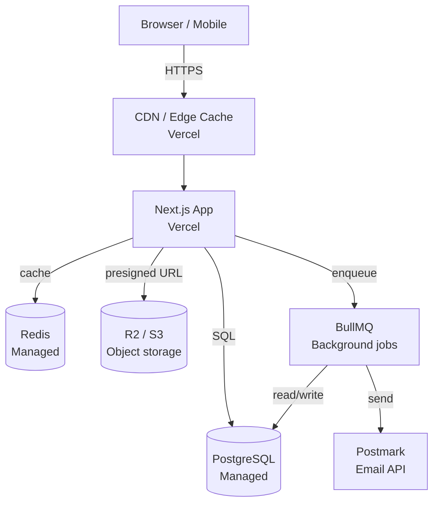

# Technical Decision Brief: <Project Name>

> The handoff contract from the **BA Agent** to the **Solution Architect**.
> The BA fills the top half; the SA fills the bottom half. This file is
> the single source of truth for the stack decision; it feeds
> `code-builder/config-rules.md` and the per-feature tech specs.

**Project:** <Project Name>
**BA completed:** <Date>
**SA completed:** <Date>
**Orchestrator approved:** <Date>

---

## Part 1 — BA inputs (must be complete before SA starts)

### 1.1 Project summary

- **Project name:** <name>
- **One-line summary:** <copy from PRD §1>
- **Problem alignment:** <copy from PRD §2>
- **MVP scope:** <copy from PRD §7 "MVP must include">
- **Target launch window:** <copy from PRD §3>

**Cross-references:** `PRD/<project>/prd.md` §1, §2, §3, §7

---

### 1.2 Hard tech constraints (from PRD §3b)

> Non-negotiables the SA cannot override. Any change to this list requires
> explicit re-approval from the Orchestrator and the user.

**Must use:**
- <e.g., "Customer DB already on PostgreSQL 14 — must use, do not migrate">
- <e.g., "SSO via Okta — must use, not Auth0 or custom">

**Must avoid:**
- <e.g., "No PHP — team has no PHP experience">
- <e.g., "No vendor lock-in for storage — must be S3-compatible (AWS S3, R2, MinIO)">

**Cross-references:** `PRD/<project>/prd.md` §3b; `assumptions.md` for related assumptions

---

### 1.3 Stack-selection questionnaire

> Mirrors the 5 questions in `code-builder/config-rules.md` §"User
> Questions Before Building". Each must have a definitive answer (or be
> marked `defer-to-SA` with a reason).

| # | Question | Answer | Source |
|---|----------|--------|--------|
| 1 | What is the primary purpose of this application? | <e.g., "Customer-facing booking platform with realtime availability"> | PRD §1, §6 |
| 2 | Expected user volume at launch? | <e.g., "10k MAU at launch, 100k at 12 months"> | PRD §3a S-002 |
| 3 | Any existing technology constraints? | <see 1.2 above> | PRD §3b |
| 4 | Team familiarity with any framework? | <e.g., "React + TypeScript, 3 yrs; no Vue/Svelte experience"> | User interview |
| 5 | Budget constraints? | <e.g., "<$500/mo at MVP; can scale to $2k/mo by 12 months"> | User interview |

**Cross-references:** `code-builder/config-rules.md` §User Questions

---

### 1.4 Integrations (from PRD §9b)

> Every third-party system the product depends on. The SA must design
> around each.

| System | Purpose | Auth model | Failure mode | Data shared |
|--------|---------|-----------|--------------|-------------|
| <e.g., Stripe> | <payments> | <API key + webhook signing secret> | <queue + retry; user sees "we'll confirm shortly"> | <email, amount, last4> |
| <e.g., Postmark> | <transactional email> | <server token> | <queue + retry> | <email, content> |
| <e.g., S3 / R2> | <file uploads> | <IAM role / signed URL> | <user sees upload error; retry> | <user-uploaded files> |

**Cross-references:** `PRD/<project>/prd.md` §9b; `prd.md` §12a R-001 for Stripe outage risk

---

### 1.5 Data sensitivity profile (from `data-model.md`)

| Classification | Fields | Volume | Compliance impact |
|----------------|--------|--------|---------------------|
| Direct PII | <email, name, phone> | <10k users> | <GDPR right-to-erasure required> |
| Indirect PII | <booking_id linked to user> | <100k> | <GDPR right-to-erasure cascades> |
| Financial | <payment_id, amount> | <100k> | <7-year retention; PCI DSS scope> |
| No PII | <slot_id, timestamp> | <unbounded> | <none> |

**Cross-references:** `PRD/<project>/data-model.md` §PII handling summary

---

### 1.6 Compliance & residency (from PRD §3a, §9a)

- **Applicable regulations:** <e.g., GDPR, PCI DSS, SOC 2 Type 1 (Phase 2)>
- **Data residency requirement:** <e.g., EU-only at MVP; multi-region in Phase 3>
- **Audit logging requirements:** <e.g., all PII access logged with user, timestamp, reason>
- **DPA / privacy policy owner:** <role>

**Cross-references:** `PRD/<project>/nfr-catalog.md` SEC-*, DR-*

---

### 1.7 Non-functional targets (from `nfr-catalog.md`)

> The targets the SA's architecture must hit. Full testable statements
> live in `nfr-catalog.md`; this is the executive list.

- **Performance:** p95 page < 2.0s, API p95 < 300ms (NFR P-001, P-002)
- **Accessibility:** WCAG 2.1 AA 100% (NFR A-001)
- **Browser support:** last 2 versions of Chrome, Safari, Firefox, Edge (NFR B-001..005)
- **Scalability:** 1k concurrent at MVP, 100k MAU at 12 months (NFR S-001, S-002)
- **Availability:** 99.5% monthly uptime (NFR AV-001)
- **Security:** all NFRs in SEC-* must be met pre-launch

**Cross-references:** `PRD/<project>/nfr-catalog.md`

---

### 1.8 Open questions blocking the architecture decision

> Pulled from `open-questions.md` filtered by `blocker-for: tech`.
> The SA cannot start until these are resolved (or explicitly marked
> `accept-risk` by the user).

| OQ-ID | Question | Owner | Status |
|-------|----------|-------|--------|
| OQ-### | <text> | <role> | Open / Resolved / accept-risk |
| OQ-### | ... | ... | ... |

**Cross-references:** `PRD/<project>/open-questions.md` §Filter views

---

### 1.9 Phasing window

> The phase(s) this tech decision must support. Decisions for later
> phases can be deferred.

- **This brief must cover:** <e.g., "MVP + Phase 2">
- **Explicitly out of scope:** <e.g., "Phase 3 multi-region — separate brief later">

**Cross-references:** `PRD/<project>/phasing-plan.md`; `prd.md` §8a

---

### 1.10 Traffic & access-pattern profile (from `traffic-profile.md`)

> The load *distribution* the architecture must serve. NFR §1.7 gives the
> averages (concurrent users, MAU); this section gives the shape that turns
> averages into a sizing decision. Without it the SA hits the mean and
> fails the peak.

- **Peak : average ratio:** <e.g., "5:1 weekday-morning; see traffic-profile §1">
- **Net read : write ratio:** <e.g., "~30:1 read-heavy; cache + read-replica from MVP">
- **Hot endpoints (top 3):** <e.g., "coach profile 45%, availability 20%, dashboard 10%">
- **Geographic split:** <e.g., "EU 90% at MVP; US 20% by 12 months — single EU region, edge-served">
- **Background / batch load:** <e.g., "hourly reminder bursts; Stripe webhook spikes; weekly reconciliation">
- **Load-bearing assumptions:** <list A-IDs from traffic-profile §7 the SA is sizing against>

**Cross-references:** `PRD/<project>/traffic-profile.md` (full profile); `nfr-catalog.md` S-001/S-002, P-001..P-005

---

## Part 2 — Solution Architect outputs (SA fills in)

### 2.1 Chosen stack

| Layer | Choice | Version | Rationale (link to 2.2) |
|-------|--------|---------|--------------------------|
| Frontend framework | <e.g., Next.js> | <e.g., 15.x> | §2.2 row 1 |
| Language (frontend) | <e.g., TypeScript> | <e.g., 5.x> | §2.2 row 2 |
| Backend framework | <e.g., Next.js API routes (for MVP); separate service in Phase 2> | <e.g., 15.x> | §2.2 row 3 |
| Language (backend) | <e.g., TypeScript> | <e.g., 5.x> | §2.2 row 3 |
| Database (primary) | <e.g., PostgreSQL> | <e.g., 16> | §2.2 row 4 |
| Database (cache) | <e.g., Redis> | <e.g., 7> | §2.2 row 5 |
| ORM / query layer | <e.g., Prisma> | <e.g., 5.x> | §2.2 row 6 |
| Auth | <e.g., Auth.js (NextAuth) + Okta provider> | <e.g., 5.x> | §2.2 row 7 |
| File storage | <e.g., Cloudflare R2 (S3-compatible)> | <e.g., n/a> | §2.2 row 8 |
| Email | <e.g., Postmark> | <e.g., n/a> | §2.2 row 9 |
| Background jobs | <e.g., BullMQ on Redis> | <e.g., 5.x> | §2.2 row 10 |
| Hosting (frontend) | <e.g., Vercel> | <e.g., n/a> | §2.2 row 11 |
| Hosting (backend) | <e.g., Vercel (MVP); separate Node host in Phase 2> | <e.g., n/a> | §2.2 row 11 |
| Observability | <e.g., Sentry + Grafana Cloud> | <e.g., n/a> | §2.2 row 12 |
| CI/CD | <e.g., GitHub Actions> | <e.g., n/a> | §2.2 row 13 |

---

### 2.2 Rationale per choice

> For every row in 2.1, document why, the trade-offs accepted, and the
> alternatives considered. This is the audit trail for future
> "why did we choose this?" questions.

| # | Choice | Why | Trade-offs accepted | Alternatives considered & rejected |
|---|--------|-----|----------------------|--------------------------------------|
| 1 | Next.js | <e.g., "Team has 3 yrs React experience; SSR + file-based routing reduce MVP time by ~30%"> | <e.g., "Vendor-aligned with Vercel for hosting (mitigated by self-host fallback)"> | <e.g., "Remix (smaller community), SvelteKit (no team experience)"> |
| 2 | TypeScript | <e.g., "Catches class of bugs at compile time; team already using it"> | <e.g., "Slightly slower iteration than JS for prototypes"> | <e.g., "JavaScript (rejected: too many runtime bugs in past projects)"> |
| 3 | Next.js API routes for MVP | <e.g., "Single deploy unit; fewer moving parts at MVP"> | <e.g., "Couples frontend and backend deploys (acceptable at MVP scale)"> | <e.g., "Separate Express service (rejected: premature for MVP scale)")> |
| 4 | PostgreSQL | <e.g., "ACID for financial data; JSON support for flexible fields; team experience"> | <e.g., "Operational overhead vs managed NoSQL"> | <e.g., "MongoDB (rejected: financial data needs ACID); Supabase (deferred: vendor lock)"> |
| ... | ... | ... | ... | ... |

---

### 2.3 Architecture diagram

> Mermaid diagram showing the runtime architecture. Updates as the
> system evolves.



**Plain-text fallback:**

```
Client ──HTTPS──► Edge (Vercel CDN) ──► App (Next.js on Vercel)
                                              │
                              ┌───────────────┼───────────────┐
                              ▼               ▼               ▼
                          PostgreSQL       Redis         R2 (S3 API)
                                              │
                                              ▼
                                          BullMQ ──► Postmark
```

---

### 2.4 Data model proposal

> High-level schema sketch the SA commits to. Detailed migrations are
> a separate deliverable, but the entities, key fields, and
> relationships must be agreed before code starts.

**Tables (PostgreSQL):**

```
users
  id            UUID PK
  email         TEXT UNIQUE NOT NULL
  name          TEXT NOT NULL
  created_at    TIMESTAMPTZ NOT NULL DEFAULT now()
  deleted_at    TIMESTAMPTZ NULL

bookings
  id            UUID PK
  user_id       UUID FK → users(id) NOT NULL
  slot_id       UUID FK → slots(id) NOT NULL
  status        TEXT NOT NULL CHECK (status IN ('pending','confirmed','cancelled','completed','no_show'))
  created_at    TIMESTAMPTZ NOT NULL DEFAULT now()
  confirmed_at  TIMESTAMPTZ NULL
  cancelled_at  TIMESTAMPTZ NULL
  ...
```

**Indexes:** `(users.email)`, `(bookings.user_id)`, `(bookings.slot_id)`, `(bookings.status)`, `(bookings.created_at)`

**Migrations:** managed via Prisma Migrate (or whichever ORM chosen in 2.1).

**Cross-references:** `PRD/<project>/data-model.md` for requirements; this is the schema answer.

---

### 2.5 Integration plan

> Per integration from §1.4: auth model in the SA's stack, retry/error
> policy, fallback behaviour, and the abstraction the code uses (so
> the vendor can be swapped later).

| Integration | SA's abstraction | Auth in our code | Retry policy | Fallback |
|-------------|------------------|-------------------|---------------|----------|
| <e.g., Stripe> | `<PaymentProvider>` interface; `StripeProvider` impl | API key in env; webhook signing secret verified | 3 retries, exponential backoff, then DLQ | Queue writes; user sees "we'll confirm shortly" |
| <e.g., Postmark> | `<EmailProvider>` interface; `PostmarkProvider` impl | Server token in env | 3 retries, exponential backoff | DLQ + alert on-call |
| <e.g., R2 / S3> | `<ObjectStore>` interface; `S3Provider` impl | IAM role via instance profile / Vercel integration | N/A (direct user upload via presigned URL) | User sees upload error; can retry |

**Key principle:** every external integration goes behind an interface
so we can swap vendors without rewriting the calling code. The
`provider-factory` reads from env to pick the impl.

---

### 2.6 Risk register additions

> Anything the SA sees that the BA did not capture in `risks.md`.
> Adds to, does not replace, the BA's register.

| ID | Risk | Likelihood | Impact | Mitigation |
|----|------|------------|--------|------------|
| SA-R-001 | <e.g., "Vercel cold start exceeds NFR P-001 target at low traffic"> | Medium | Medium | <e.g., "Configure edge caching for static routes; add warm-up ping from cron"> |
| SA-R-002 | ... | ... | ... | ... |

---

### 2.7 Open questions for BA

> Anything the SA needs the BA to clarify before finalising. Added to
> `open-questions.md` with `blocker-for: tech`.

| OQ-ID | Question | Why SA needs it | When needed |
|-------|----------|------------------|-------------|
| OQ-### | <e.g., "What is the expected average file upload size?"> | <e.g., "Drives presigned URL expiry + chunking decision"> | <e.g., "Before MVP code starts"> |

---

### 2.8 Sign-off

> When Part 2 is complete, the SA, BA, and Orchestrator sign here. The
> sign-off block is the trigger for the Orchestrator to begin
> scheduling Design Agents.

**Solution Architect:** <name, date>
**BA acknowledgement:** <name, date> (confirms the SA's choices respect §1.2 hard constraints and §1.7 NFRs)
**Orchestrator approval:** <name, date>

**Once signed, this brief is the source of truth for:**
- `code-builder/config-rules.md` — which template + library choices apply
- Design Agent specs — what API contracts to design around
- Code Agent task briefs — what stack each feature builds in
- QA Agent test plan — what tools/environments to test against

---

*This brief is a living document for the project's lifetime. When the stack changes (e.g., new integration added in Phase 2), append a new Part 2 section ("2.9 Phase 2 stack changes") rather than rewriting history — the audit trail matters.*
